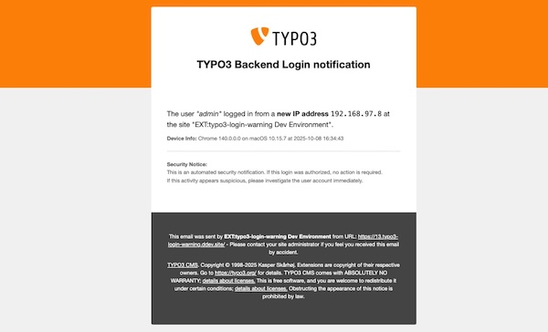

<div align="center">


# TYPO3 extension `typo3_login_warning`

[](https://extensions.typo3.org/extension/typo3_login_warning)
[](https://extensions.typo3.org/extension/typo3_login_warning)
[](https://coveralls.io/github/move-elevator/typo3-login-warning)
[](https://github.com/move-elevator/typo3-login-warning/actions/workflows/cgl.yml)
[](https://github.com/move-elevator/typo3-login-warning/actions/workflows/tests.yml)
[](LICENSE.md)

</div>

This extension extends the TYPO3 backend login [warning_mode](https://docs.typo3.org/m/typo3/reference-coreapi/main/en-us/Security/GuidelinesIntegrators/GlobalTypo3Options.html#security-global-typo3-options-warning-mode) functionality to inform about suspicious logins with several features:

- [**New IP**](#newipdetector) based warning to detect logins from new IP addresses
- [**Long Time No See**](#longtimenoseedetector) notification for infrequent users
- [**Out Of Office**](#outofofficedetector) login detection outside defined working hours, holidays, or vacation periods

> [!NOTE]
> Since I was annoyed by the constant login emails from the TYPO3 backend, but the issue of login security is still extremely important, I expanded the standard login notification functions of TYPO3 with some more or less well-known additional features.

## 🔥 Installation

### Requirements

* TYPO3 >= 12.4
* PHP 8.2+

### Composer

[](https://packagist.org/packages/move-elevator/typo3-login-warning)
[](https://packagist.org/packages/move-elevator/typo3-login-warning)

``` bash
composer require move-elevator/typo3-login-warning
```

### TER

[](https://extensions.typo3.org/extension/typo3_login_warning)
[](https://extensions.typo3.org/extension/typo3_login_warning)

Download the zip file from [TYPO3 extension repository (TER)](https://extensions.typo3.org/extension/typo3_login_warning).

### Setup

Set up the extension after the installation:

``` bash
vendor/bin/typo3 extension:setup --extension=typo3_login_warning
```

By default, the [**New IP**](#newipdetector) and [**Long Time No See**](#longtimenoseedetector) detectors are enabled.

## 🧰 Configuration

Configure the extension through the TYPO3 backend:

1. Go to **Settings** → **Extension Configuration**
2. Select **typo3_login_warning**
3. Configure your detectors and notification settings

### Detectors

Detectors are used to detect certain login events. If a detector matches, a notification will be sent.

> [!IMPORTANT]
> Only the first matching detector will trigger a notification.

The following detectors are available (in order of execution):

#### [NewIpDetector](Classes/Detector/NewIpDetector.php)

Detects logins from new IP addresses and triggers a warning email.

> The user "admin" logged in from a new IP address 192.168.97.5 at the site "EXT:typo3-login-warning Dev Environment".

The IP address will be stored and can be hashed for privacy reasons. You can also define a whitelist of IP addresses that will not trigger a warning. An IP geolocation lookup can be enabled to add more information to the notification email.

**Configuration Options:**

| Setting | Description | Default     |
|---------|-------------|-------------|
| **Active** | Enable New IP detector | `true`      |
| **Hash IP Addresses** | Hash IP addresses for privacy (SHA-256) | `true`      |
| **Fetch Geolocation** | Enable IP geolocation lookup | `true`      |
| **IP Whitelist** | Comma-separated list of whitelisted IPs/networks (supports CIDR notation like `192.168.1.0/24`) | `127.0.0.1` |
| **Affected Users** | Which users should trigger this detector: `All Users`, `Only Admins`, `Only System Maintainers` | `All Users` |
| **Notification Receiver** | Who should receive the notification: `Email Recipients`, `Logged-In User`, `Both` | `Email Recipients` |

##### Geolocation

If `Fetch Geolocation` is enabled, the extension will use the [ip-api.com](https://ip-api.com/) service to fetch geolocation information for the IP address. Only public IP addresses will be looked up to respect privacy.

> [!TIP]
> You can implement your own geolocation service by implementing the `GeolocationServiceInterface` and registering it in the DI container.

```yaml
services:
  MoveElevator\Typo3LoginWarning\Service\GeolocationServiceInterface:
    alias: Vendor\MyExtension\Service\MyCustomGeolocationService
```

#### [LongTimeNoSeeDetector](Classes/Detector/LongTimeNoSeeDetector.php)

Detects logins after a long period of inactivity (default: 365 days).

> The user "admin" logged in again after a long time (643 days) at the site "EXT:typo3-login-warning Dev Environment".

**Configuration Options:**

| Setting | Description | Default |
|---------|-------------|---------|
| **Active** | Enable Long Time No See detector | `true` |
| **Threshold Days** | Days of inactivity before triggering | `365` |
| **Affected Users** | Which users should trigger this detector: `All Users`, `Only Admins`, `Only System Maintainers` | `All Users` |
| **Notification Receiver** | Who should receive the notification: `Email Recipients`, `Logged-In User`, `Both` | `Email Recipients` |

#### [OutOfOfficeDetector](Classes/Detector/OutOfOfficeDetector.php)

Detects logins outside defined working hours, holidays, or vacation periods. Supports flexible working hours with multiple time ranges per day (e.g., lunch breaks), timezone handling, and comprehensive out-of-office period configuration.

> The user "admin" logged in outside office hours at the site "EXT:typo3-login-warning Dev Environment".

**Configuration Options:**

| Setting | Description | Default                        |
|---------|-------------|--------------------------------|
| **Active** | Enable Out Of Office detector | `false`                        |
| **Working Hours** | JSON configuration for working hours (supports multiple time ranges per day for lunch breaks) | Business hours (06-19) Mon-Fri |
| **Timezone** | Timezone for working hours | `UTC`                          |
| **Holidays** | Comma-separated list of holidays in Y-m-d format (e.g., `2025-01-01,2025-12-25`) | Empty                          |
| **Vacation Periods** | Comma-separated vacation periods in start:end format (e.g., `2025-07-15:2025-07-30,2025-12-20:2025-12-31`) | Empty                          |
| **Affected Users** | Which users should trigger this detector: `All Users`, `Only Admins`, `Only System Maintainers` | `All Users` |
| **Notification Receiver** | Who should receive the notification: `Email Recipients`, `Logged-In User`, `Both` | `Email Recipients` |

**Working Hours JSON Example:**
```json
{
  "monday": [["09:00", "12:00"], ["13:00", "17:00"]],
  "tuesday": ["09:00", "17:00"],
  "friday": ["09:00", "15:00"]
}
```

#### Custom Detectors

> [!TIP]
> You can implement your own detector by implementing the [`DetectorInterface`](Classes/Detector/DetectorInterface.php) and registering it in the DI container.

```yaml
services:
  Vendor\MyExtension\Detector\CustomDetector:
    tags:
      - { name: typo3_login_warning.detector, priority: 200 }
```

### Notification

Notification methods are used to notify about detected login events.

The following notification methods are available:

#### [EmailNotification](Classes/Notification/EmailNotification.php)

Sends a warning email to defined recipients. If no recipient is defined, the email will be sent to the address defined in `$GLOBALS['TYPO3_CONF_VARS']['BE']['warning_email_addr']`.

**Global Configuration Options:**
- **Email Recipients**: Email address(es) of the notification recipients (comma-separated)

**Per-Detector Configuration:**

Each detector has its own **Notification Receiver** setting that controls who receives notifications:
- **Email Recipients** (default): Send notification only to configured email recipients
- **Logged-In User**: Send notification only to the logged-in user (requires valid email address)
- **Both**: Send notification to both email recipients and logged-in user



##### Templates

You can override the email templates located in `Resources/Private/Templates/Email/Default/LoginNotification/`.

```php
$GLOBALS['TYPO3_CONF_VARS']['MAIL']['templateRootPaths'][1000] = 'EXT:my_sitepackage/Resources/Private/Templates/Email/';
```

#### Custom Notifiers

> [!TIP]
> You can implement your own notification method by implementing the [`NotifierInterface`](Classes/Notification/NotifierInterface.php) and registering it in the DI container.

```yaml
services:
  Vendor\MyExtension\Notification\SlackNotification:
    tags:
      - { name: typo3_login_warning.notifier }
```

## 🧑‍💻 Contributing

Please have a look at [`CONTRIBUTING.md`](CONTRIBUTING.md).

## ⭐ License

This project is licensed
under [GNU General Public License 2.0 (or later)](LICENSE.md).